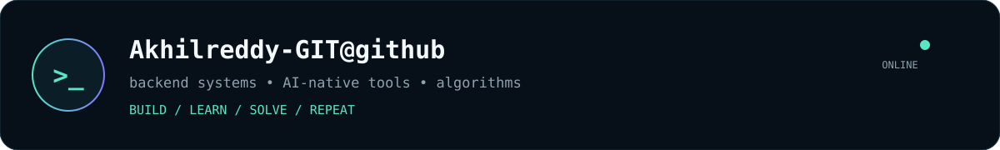
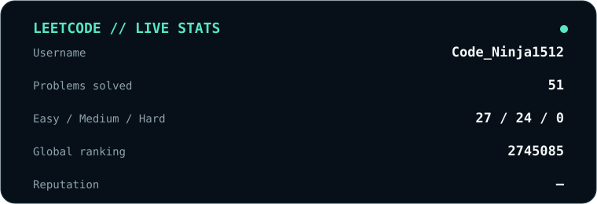
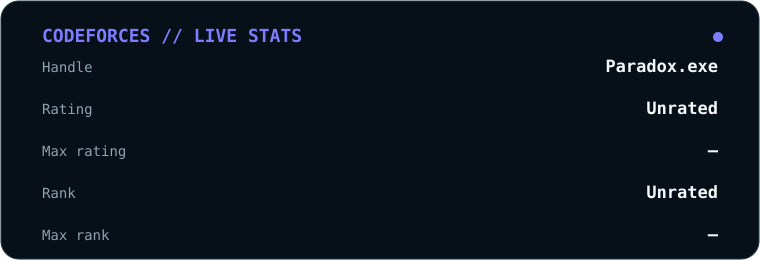

<div align="center">


<br><br>

<a href="https://git.io/typing-svg">

</a>

<br>

# 👋 Hi, I'm **Akhil**

### `CS Student` · `Backend Builder` · `AI/ML Explorer` · `Problem Solver`

<p>
<a href="https://www.linkedin.com/in/karumuru-nagasai-akhil-reddy-3a3b24414"></a>
<a href="mailto:kns.akhilreddy@gmail.com"></a>
<a href="https://github.com/Akhilreddy-GIT"></a>
</p>

<sub>📍 Andhra Pradesh, India · 🎓 B.Tech CSE · GVPCDPGC · 2029</sub>

</div>

---



## `whoami`

```text
> Akhilreddy-GIT@github:~$ whoami

A developer who turns ideas into real products.

├── ⚙️  Backend systems with FastAPI
├── 🤖  AI-native applications & LLM tooling
├── 🧠  DSA + competitive programming
├── 🗄️  Databases, Redis, Docker & system design
└── 🚀  Learning by shipping, breaking and rebuilding
```

<table>
<tr>
<td width="20%" align="center">🎓<br><b>2nd Year CS</b><br><sub>GVPCDPGC · 2029</sub></td>
<td width="20%" align="center">⚙️<br><b>Backend</b><br><sub>Python · FastAPI · SQL</sub></td>
<td width="20%" align="center">🤖<br><b>AI / LLM</b><br><sub>LangChain · Groq · PyTorch</sub></td>
<td width="20%" align="center">🧠<br><b>DSA</b><br><sub>TUF + A2Z · CF · LC</sub></td>
<td width="20%" align="center">🌱<br><b>Learning</b><br><sub>Redis · Docker · Systems</sub></td>
</tr>
</table>

---

## 🟢 Currently building

### `01` · InternHub
**An internship tracker built as my primary backend learning vehicle.**

`FastAPI` `SQLAlchemy` `Pydantic` `SQLite` `REST APIs`

- Request/response schemas
- Database relationships
- CRUD + filtering
- Authentication roadmap
- Moving toward production-style architecture

### `02` · AI-native tools
**Practical AI applications rather than prompt-only experiments.**

`LangChain` `Groq` `LLMs` `Vision` `Tool Calling`

- AI workflows
- Tool calling
- RAG / retrieval
- Vision-based utilities
- Real-time AI concepts

---

# 📊 GitHub Analytics

<div align="center">


<br><br>


<br><br>


</div>

---

# 🧠 Competitive Programming — live

<div align="center">




</div>

> The two cards are regenerated automatically by GitHub Actions. Set the public usernames once in `stats-config.json`.

---

# 🛠️ Stack

<div align="center">

### Languages


### Backend · Data · DevOps


### AI / ML


<br><br>


</div>

---

# 🚀 Featured Projects

<div align="center">










</div>

---

# 🧩 What I'm learning

| Area | Current focus |
|:---|:---|
| 🐍 **Python** | Backend engineering + DSA |
| ⚡ **FastAPI** | API architecture + async systems |
| 🗄️ **Databases** | SQL · PostgreSQL · SQLAlchemy |
| 🧠 **DSA** | TUF + A2Z · LeetCode · Codeforces |
| 🤖 **AI/LLMs** | LangChain · Groq · RAG · tool calling |
| 🐳 **DevOps** | Docker · GitHub Actions |
| 🌐 **Systems** | Redis · WebSockets · system design |

---

# 🐍 Contribution Snake

<div align="center">

<picture>
<source media="(prefers-color-scheme: dark)" srcset="https://raw.githubusercontent.com/Akhilreddy-GIT/Akhilreddy-GIT/output/github-contribution-grid-snake-dark.svg">
<source media="(prefers-color-scheme: light)" srcset="https://raw.githubusercontent.com/Akhilreddy-GIT/Akhilreddy-GIT/output/github-contribution-grid-snake.svg">

</picture>

</div>

---

# 🧪 My build loop

```text
             ┌──────────────┐
             │   IDEA 💡    │
             └──────┬───────┘
                    ↓
             ┌──────────────┐
             │   BUILD 🛠️  │
             └──────┬───────┘
                    ↓
             ┌──────────────┐
             │   BREAK 🧪   │
             └──────┬───────┘
                    ↓
             ┌──────────────┐
             │  DEBUG 🔍    │
             └──────┬───────┘
                    ↓
             ┌──────────────┐
             │   LEARN 📚   │
             └──────┬───────┘
                    ↓
             ┌──────────────┐
             │   SHIP 🚀    │
             └──────┬───────┘
                    │
                    └──────────→ REPEAT
```

---

# 💬 Ask me about

<div align="center">

`FastAPI` · `Python` · `REST APIs` · `SQLAlchemy` · `Async Python`  
`LangChain` · `Groq` · `LLM Tool Calling` · `DSA` · `Backend Architecture`

</div>

---

# 🎯 Direction

```text
2026
│
├── Backend engineering
├── Competitive programming
├── AI / LLM applications
├── Open-source contribution
└── Strong CS fundamentals
        │
        ▼
2027+
│
└── Build systems that people actually use.
```

---

<div align="center">

<a href="https://leetcode.com/"></a>
<a href="https://codeforces.com/"></a>
<a href="https://github.com/Akhilreddy-GIT"></a>

<br><br>

### `BUILD • LEARN • SOLVE • REPEAT`

<sub>Made with ❤️ by Akhil · Thanks for visiting.</sub>

<br><br>


</div>
